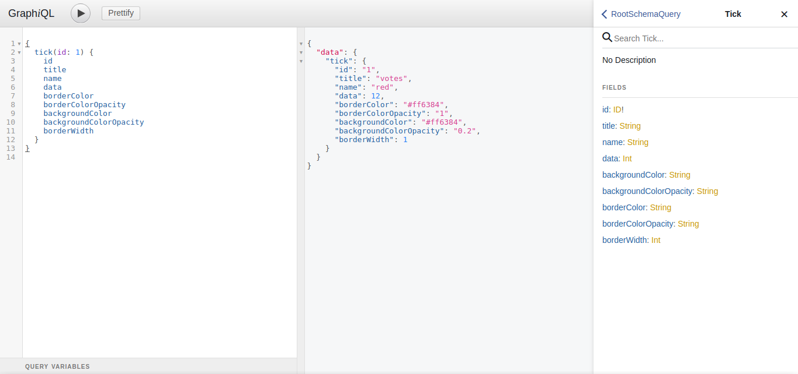
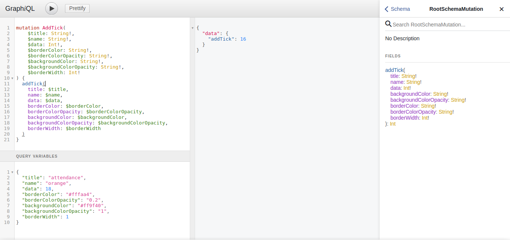

# Graph API

This is a simple api that you can use to store data and get it based on id or retrieve them all for rendering a graph bar.

The sample structure is in [data.json](data.json) in root directory and [here](https://jsfiddle.net/emrahsif/rfm7psya/) you may see the result.

## Table of Contents

* [Built with](#built-with)
  * [Development Environment](#development-environment)
  * [Third-Party Dependencies](#third-party-dependencies)
* [Getting Started](#getting-started)
  * [Prerequisite](#prerequisite)
  * [Installation](#installation)
* [Running](#running)
* [GraphQL Examples](#graphql-examples)
  * [Basic Query](#basic-query)
  * [Mutation](#mutation)
* [Resources](#resources)

## Built with

For development purposes I didn't use any framework but only two 3rd party dependencies.

I attempted to develop a micro framework with common functionality such as routing, template rendering also features like login and registration.

My goal is to simulate how a modern day framework works and only then develop the project top of the core application.

#### Development Environment
* [Ubuntu](https://www.ubuntu.com/download/server) - Server
* [MySQL](https://www.mysql.com/) - Database
* [PHP](http://php.net/) - Language
* [Linux Mint 18](https://www.linuxmint.com/) - OS
* [PhpStorm](https://www.jetbrains.com/phpstorm/) - IDE
* [Chromium](https://www.chromium.org/Home) - Browser

#### Third-Party Dependencies
* [The Yaml Component](https://symfony.com/doc/3.3/components/yaml.html) - The Yaml component loads and dumps YAML files
* [GraphQL](https://github.com/Youshido/GraphQL) - Pure PHP realization of GraphQL protocol

## Getting Started

These instructions will guide you to up and running the project on your local machine.

### Prerequisite

* Composer 
* Apache(or Nginx)
* MySQL

### Installation

In root directory you will find graph.sql. First import it to MySQL database manually.

Then update parameters in app/config/config.yml.dist and save this file as config.yml.

``` yml
dataSource:
    database:
        host: localhost
        name:
        user:
        password:

graphQL:
    endpoint: http://localhost:8000/graph
```

Now you can run ```composer install``` to install dependencies.

## Running

You can start the server with `composer run-script serve`. Below you may find route list.

| Method  | Path                         | Info                          |
| ------  | ---------------------------  | ----------------------------- |
| GET     | [/graph](http://localhost:8000/graph)                     | bar graph data                    |
| GET     | [/graphql](http://localhost:8000/graphql)                   | explorer                      |
| POST    | [/graphql](http://localhost:8000/graphql)                   | endpoint                      |

## GraphQL Examples

REST is a well-known specification but APIs based on it have some disadvantages when it comes to resolve multiple requests.

GraphQL on the other hand brings a new way that allows you to get exactly the data you’re looking for in one request.

Following examples show how queries and mutations can be ran via explorer or from command line.

### Basic Query

This query is asking for all fields on tick object.

**explorer:**



```js
{
  tick(id: 1) {
    id
    title
    name
    data
    borderColor
    borderColorOpacity
    backgroundColor
    backgroundColorOpacity
    borderWidth
  }
}
```

**cmd:**
```
$ curl -X POST \
-H "Content-Type: application/json" \
-d '{ "query": "{ tick(id: 1) { id title name data borderColor borderColorOpacity backgroundColor backgroundColorOpacity borderWidth } }" }' \
http://localhost/graphql
```

**Response:**
```json
{
  "data": {
    "tick": {
      "id": "1",
      "title": "votes",
      "name": "red",
      "data": 12,
      "borderColor": "#ff6384",
      "borderColorOpacity": "1",
      "backgroundColor": "#ff6384",
      "backgroundColorOpacity": "0.2",
      "borderWidth": 1
    }
  }
}
```

### Mutation

`addTick` is asking to create a new tick object. Result will be the id. 

**explorer:**



```js
mutation AddTick(
    $title: String!,
    $name: String!,
    $data: Int!,
    $borderColor: String!,
    $borderColorOpacity: String!,
    $backgroundColor: String!,
    $backgroundColorOpacity: String!,
    $borderWidth: Int!
) {
  addTick(
    title: $title,
    name: $name,
    data: $data,
    borderColor: $borderColor,
    borderColorOpacity: $borderColorOpacity,
    backgroundColor: $backgroundColor,
    backgroundColorOpacity: $backgroundColorOpacity,
    borderWidth: $borderWidth
  )
}
```

variables:
```json
{
  "title": "attendance",
  "name": "orange",
  "data": 18,
  "borderColor": "#fffaa4",
  "borderColorOpacity": "0.2",
  "backgroundColor": "#ff9f40",
  "backgroundColorOpacity": "1",
  "borderWidth": 1
}
```

**cmd:**
```
$ curl -X POST http://localhost/graphql \
  -H "Content-Type: application/json" \
  -d '{ "query": "mutation AddTick($title: String!, $name: String!, $data: Int!, $borderColor: String!, $borderColorOpacity: String!, $backgroundColor: String!, $backgroundColorOpacity: String!, $borderWidth: Int!) { addTick(title: $title, name: $name, data: $data, borderColor: $borderColor, borderColorOpacity: $borderColorOpacity, backgroundColor: $backgroundColor, backgroundColorOpacity: $backgroundColorOpacity, borderWidth: $borderWidth) }", 
  "variables": { "title": "attendance", "name": "orange", "data": 18, "borderColor": "#fffaa4", "borderColorOpacity": "0.2", "backgroundColor": "#ff9f40", "backgroundColorOpacity": "1", "borderWidth": 1 } }'
```

**Response:**
```json
{
  "data": {
    "addTick": 12
  }
}
```

## Resources

- [How to Make a PHP Template Engine](https://stackoverflow.com/questions/5540828/how-to-make-a-php-template-engine)
- [Slim Session](https://github.com/bryanjhv/slim-session)
- [An Introduction to Services](https://bitbucket.org/isidromerayo/an-introduction-to-services)
- [Integrating the Data Mappers](https://www.sitepoint.com/integrating-the-data-mappers/)
- [Options FollowSymLinks Giving Me 500 Internal Server Error](https://stackoverflow.com/questions/5646818/htaccess-options-followsymlinks-giving-me-500-internal-server-error)
- [Mage2.pro Topic 1392](https://mage2.pro/t/topic/1392/2)
- [Bootstrap Navbar Active State Not Working](https://stackoverflow.com/questions/24514717/bootstrap-navbar-active-state-not-working)
- [password_verify Returns False for Correct Password](https://teamtreehouse.com/community/passwordverify-returns-false-for-correct-password)
- [Convert Hex Color to RGB Using PHP](https://bavotasan.com/2011/convert-hex-color-to-rgb-using-php/)
- [Youshido GraphQL](https://github.com/Youshido/GraphQL)
- [jQuery Table Sorter Demo](https://jsfiddle.net/Mottie/xcqpF/1/light/)
- [Hex to RGBA Converter](http://hex2rgba.devoth.com/)
